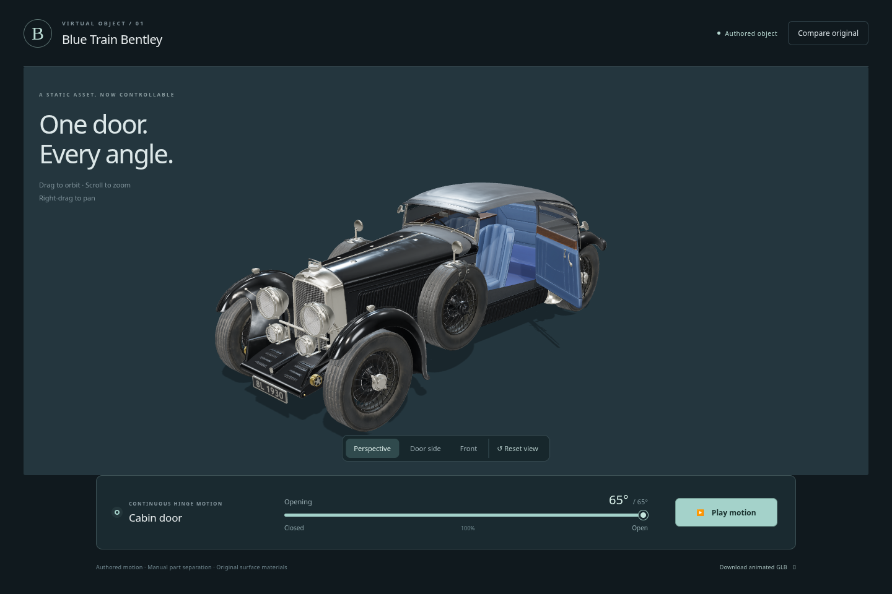

# Bentley authoring session — download package

Download `Bentley_authoring_session.zip`, then extract it. The session contains the original and animated GLB, offline preview, source/configuration, validation, provenance and report. Run `launch.sh` from the extracted session folder with Python 3 installed.

The authored cabin door opens continuously from 0 to 65 degrees. Blender and Chromium reopening checks passed. Physical clearance is incomplete: lining/sill and local hinge/trim intersections remain; see `AUTHORING_SESSION_REPORT.md`. User acceptance remains unassessed.

The ZIP has 73 manifest entries verified against their SHA-256 hashes. Its checksum is in `SHA256SUMS.txt`.

