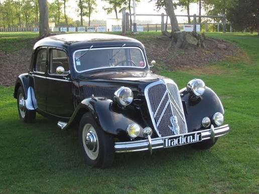
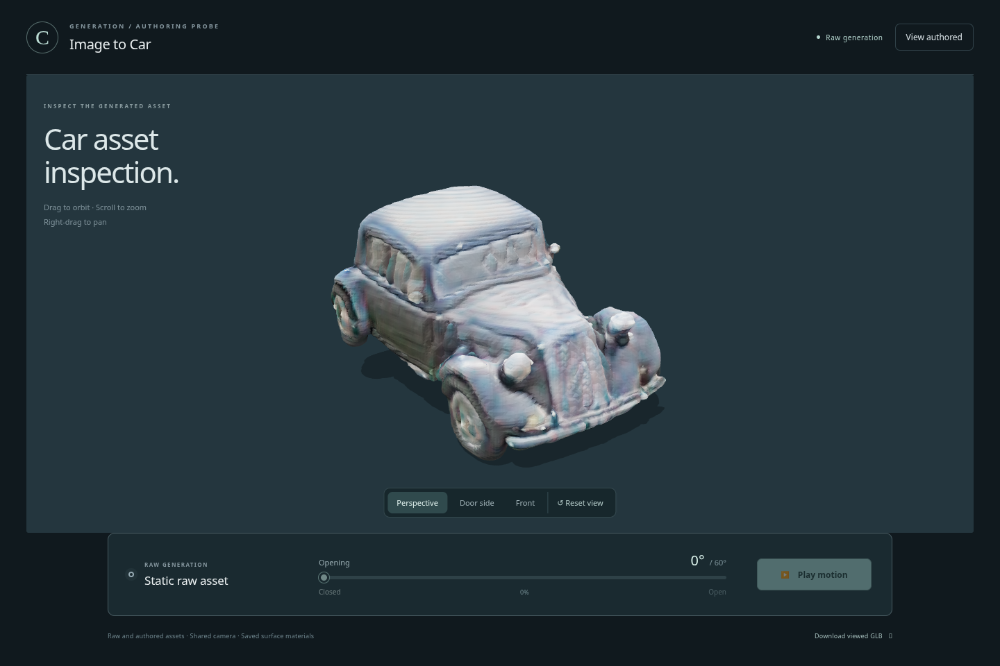
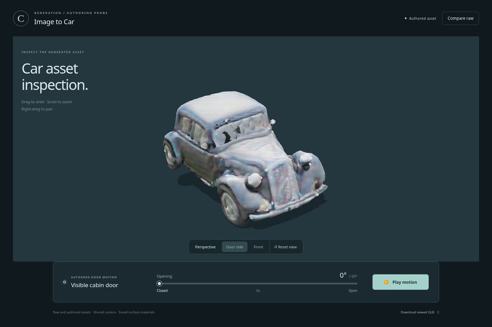
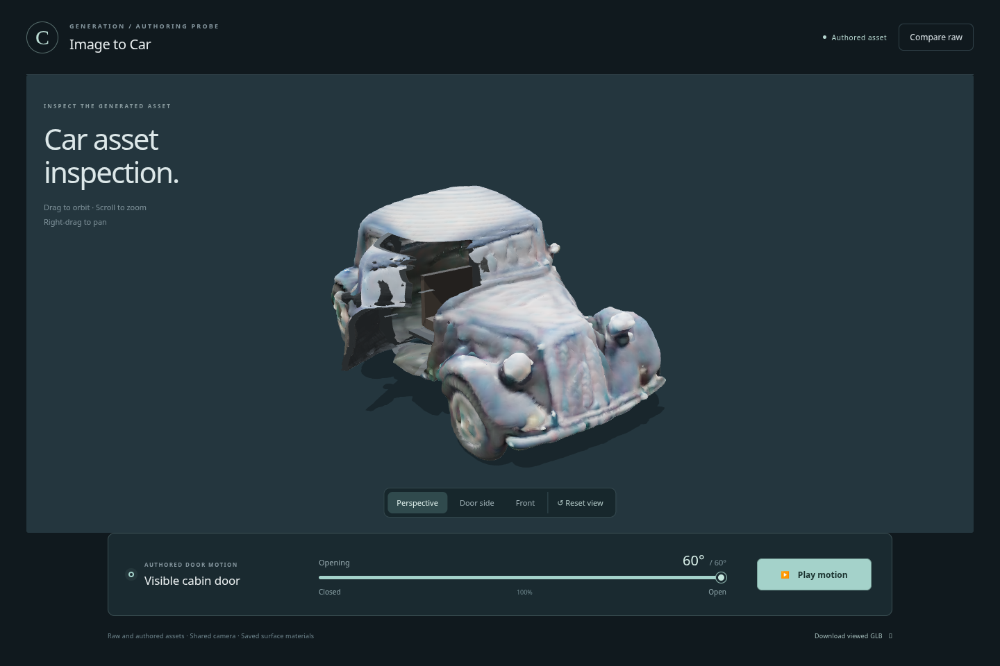
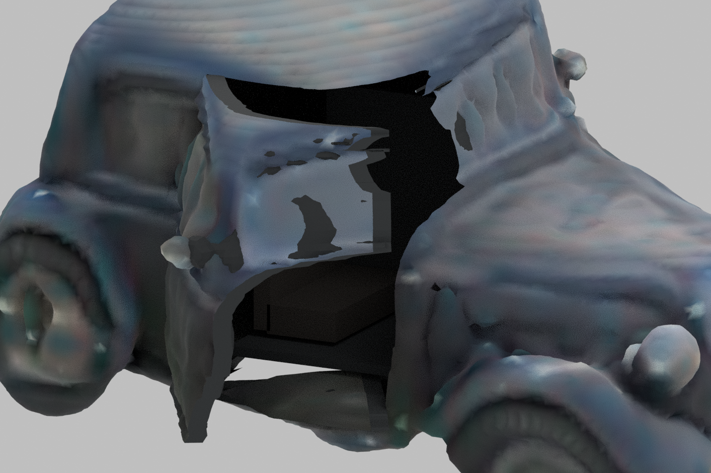

# Kết quả thử nghiệm ảnh → mô hình xe 3D

[Tải gói đầy đủ ZIP (18,6 MB)](https://github.com/MatteoPhan926/CVPR_3D/raw/refs/heads/image-to-usable-car-20261007/image_to_usable_car_probe_20261007/IMAGE_TO_USABLE_CAR_PROBE_20261007_evidence.zip) · [Báo cáo](IMAGE_TO_USABLE_CAR_REPORT.md) · [GLB đã chỉnh cửa](artifacts/car_authored.glb?raw=true) · [GLB gốc](raw/car_raw.glb?raw=true)

Đã tạo đúng một mẫu từ ảnh người dùng bằng TripoSR trên CPU, sau khi TRELLIS.2 bị dịch vụ từ chối vì quota. Bản chỉnh có chuyển động cửa 0–60°; Blender, trình xem và kiểm tra glTF đã đạt. **Đây là kết quả một phần: hình dáng xe, mép cửa và nội thất chưa đạt chất lượng CGI thuyết phục.**

## Xem nhanh ngay trên GitHub

Ảnh gốc:

Mô hình gốc:

Bản chỉnh khi đóng cửa:

Bản chỉnh khi mở 60°:

Chi tiết phần lộ ra khi mở:

## Xem 3D trên máy của bạn

1. Tải và giải nén gói ZIP bên trên.
2. Trong thư mục vừa giải nén, chạy `python source/viewer/serve.py --port 8777` (cần Python 3).
3. Truy cập máy chủ cục bộ mà lệnh in ra trong trình duyệt có WebGL2. Chọn **View authored**, dùng thanh trượt hoặc nút phát. **Compare raw** quay lại mẫu gốc ở cùng góc nhìn.

GitHub hiển thị ảnh và báo cáo; không chạy ứng dụng 3D trực tiếp trên trang repository. Bundle của trình xem đã có sẵn, không cần npm hay tải model AI để xem kết quả.

Gói gồm ảnh gốc, GLB gốc và bản chỉnh, file Blender, viewer, mã nguồn/configuration, báo cáo và bằng chứng kiểm tra. Không gồm bộ trọng số AI và môi trường cài đặt dung lượng lớn. `MANIFEST_SHA256.json` xác minh các file bằng chứng; checksum của ZIP nằm cạnh file ZIP.
